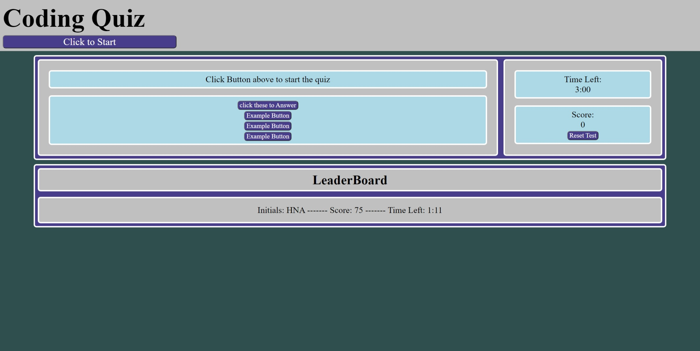

# Coding-Quiz

## Prjoect Info

This coding quiz was developed using HTML, CSS, and Javascript. The pages basic layout and style are defined with HTML and CSS while the content is set using DOM manipulation with JavaScript. The quiz works by starting with a 3 minute timer. if a question is answered correctly the user is given points and the next question is diplayed. However, if they answer incorrectly the user has points taken away and they lose 10 seconds to complete the quiz and then the next question is displayed.

The big challenge was figuring out how to store all of the questions as variables instead of having them stored in a backend or file. I opted to creat an array of Objects with the properties question, answers, and correct to store all of the data for the questions. This allowed me to control which question was displayed using the index of the Array.

The leaderboard works by storing data in localStorage using JSON.stringify and then pulling the entries back out using JSON.parse(). This allows the leaderboard to have multiple entries due to the naming convention used in the code and allows the leaderboard to persist between sessions. This allows the user to keep track of their growth.

## Page Image

## Link
https://nightmarefails.github.io/Coding-Quiz/